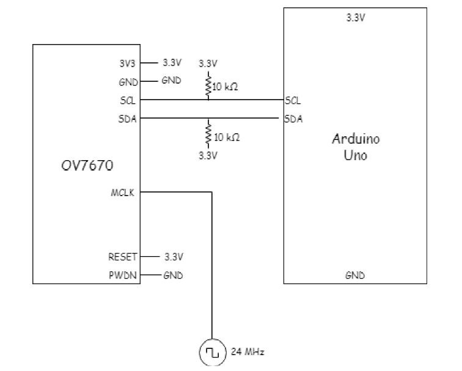
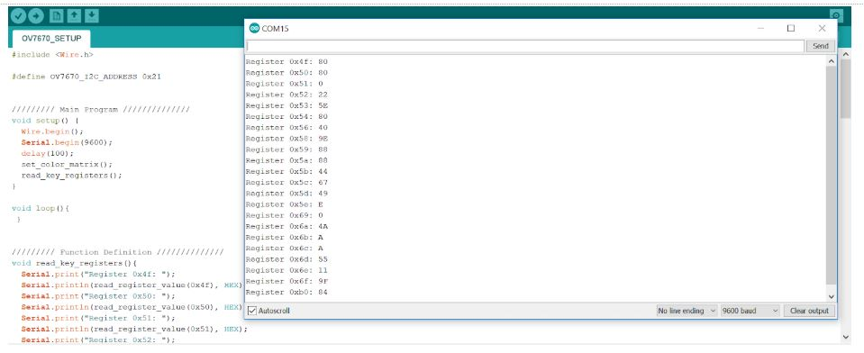
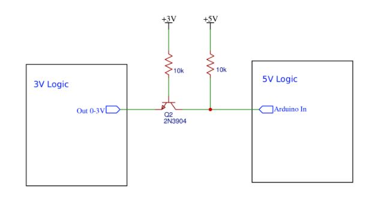
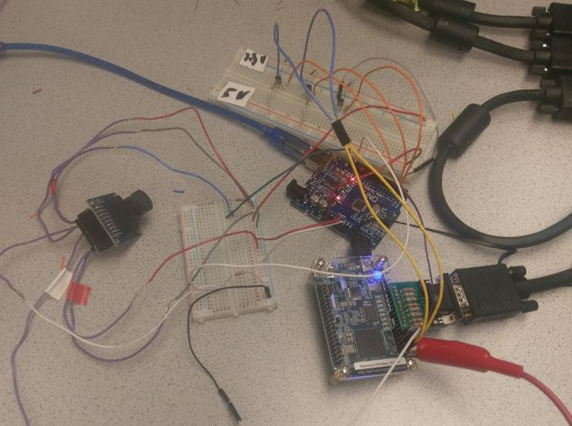
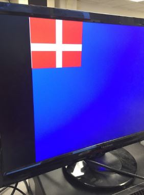

# Lab 4: Camera

## Arduino-Camera Communication
The first step was to wire the OV7670 camera to the Arduino board using the I2C interface, which uses the SCL and SDA pins. The following diagram shows the wiring:

{:height="400px" width="700px"}

The 24 MHz signal was generated on the FPGA. The active-low RESET pin was connected to the Arduino 3.3 V supply. After wiring the camera to the Arduino, we tested our I2C connection by writing and reading the register values on the camera. To read to the registers we used the following methods:

```cpp
String OV7670_write(int start, const byte *pData, int size){
    int n,error;
    Wire.beginTransmission(OV7670_I2C_ADDRESS);
    n = Wire.write(start);
    if(n != 1){
      return "I2C ERROR WRITING START ADDRESS";   
    }
    n = Wire.write(pData, size);
    if(n != size){
      return "I2C ERROR WRITING DATA";
    }
    error = Wire.endTransmission(true);
    if(error != 0){
      return String(error);
    }
    return "no errors :)";
 }

```

```cpp
String OV7670_write_register(int reg_address, byte data){
  return OV7670_write(reg_address, &data, 1);
 }
```

To read from the registers we used the following method: 
```cpp
byte read_register_value(int register_address){
  byte data = 0;
  Wire.beginTransmission(OV7670_I2C_ADDRESS);
  Wire.write(register_address);
  Wire.endTransmission();
  Wire.requestFrom(OV7670_I2C_ADDRESS,1);
  //while(Wire.available()<1);
  data = Wire.read();
  return data;
}
```
We then added a method that reads all of the register values to make sure that the provided set_color_matrix function works as expected. The method just prints the contents of all registers. The following screenshot shows that the registers hold all the expected values:

{:height="400px" width="700px"}

## Arduino-FPGA Communication:
We used parallel communication between the FPGA and the Arduino. Since the FPGA high output was around 3.3V, the Arduino digitalRead() function didn’t correctly interpret it as a 1, and it incorrectly fluctuated between 0 and 1. We therefore had to add a small voltage bias to the FPGA output when it was high and no bias when it was low. In order to achieve that we used the following circuit:


{:height="400px" width="700px"}

The following image shows the implementation of the circuit. We used the above circuit for each of the FPGA outputs.

{:height="400px" width="700px"}

We then set the FPGA output pins and tested the parallel communication using the digitalRead() function. The following video shows that the setup works as expected: 

<iframe width="640" height="480" src="https://www.youtube.com/embed/E_XYIcS4w9k" frameborder="0" allowfullscreen></iframe>

## FPGA

## PLL
Our first task with the FPGA was to create a Phase-Locked-Loop (PLL) with our three clock signals: 24MHz, 25MHz, and 50MHz. A PLL is used to prevent clock skew between the three clocks, making sure they are in phase the whole time. Following the steps provided in the lab, we successfully created our own PLL with these clock signals. The 24MHz clock signal is used for the Camera-Arduino communication, the 25MHz signal is used as the read clock for the memory buffer, and the 50MHz signal is used as the write clock for the memory buffer.

## Buffer Reader
Next, we connected the M9K RAM to the VGA driver in order to properly read and write data to the memory buffer and display it on screen. In order to do this, we had to update our X_ADDR and Y_ADDR each time data was written to the buffer, which happened at the positive edge of the 50MHz clock. This ensured that the new data would be shown in a new pixel, allowing us to create images such as the following:


{:height="400px" width="700px"}

{:height="400px" width="700px"}

We update our X_ADDR and Y_ADDR by incrementing X_ADDR every time we write, working our way from left to right across the screen. Two inputs from the camera (HREF and VSYNC) are used to determine when we should start a new row and when we should start a new image. At a positive edge of HREF, we reset X_ADDR and increment Y_ADDR, starting a new row. At a positive edge of VSYNC, we reset both X_ADDR and Y_ADDR to start a new image.

## Downsampling
The OV7670 camera outputs 16 bits of pixel data. However, it can only output 8 of those 16 bits during a clock cycle, so two cycles are needed to fully read the pixel data. We decided to sample this data on the rising edge of the camera clock. The 16 bit format of the pixel data from the camera is RGB565. This simply means that the first 5 bits of the 16 bit pixel data are the value of red, the next 6 bits are the value of green, and the last 5 bits are the value of blue. However, we can only store 8 bits of pixel data into our RAM. We downsampled the 16 bit RGB 565 data from the camera and reformatted it to be RGB 332.

We went about this reading the two bytes worth of data from the camera. We then assigned the appropriate bits from RGB 565 format to RGB 332 format. For instance, the three red bits of RGB 332 are taken from the first three bits of the first byte of RGB 565. The 3 green bits of RGB 332 are taken from the last three bits of the first byte of RGB 565. The 2 blue bits of RGB 332 are taken from the last two bits of the second byte of RGB 565. After downsampling the data, we then wrote the 8 bit data to the RAM. We only write the 8 bit data after the two full bytes of camera data read.


## Image Processing:
Now that we can display an image, our next step is to identify the image. For starters, we are only looking to see if an image is predominantly red or blue. Inside of IMAGE_PROCESSOR.v, we define the value HALF_PIXELS = 12672, representing half of the pixels we display in our image. Next, two counter registers were declared, one to track the red pixels and another to track the blue pixels. Our pixel format is RGB 332, so we define a red pixel as 8’b11X_0XX_0X and a blue pixel as 8’b0XX_0XX_11. We check each pixel as it is set and, if it is red or blue, we increment the proper counter. At the positive edge of VGA_VSYNC_NEG (which represents the start of a new image) we check if either the red counter or blue counter is greater than HALF_PIXELS. If so, we set our RESULT value accordingly. The RESULT value is a 3 bit output, where RESULT[1:0] represent the shape of a treasure and RESULT[1:0] = 2’b00 means there is no treasure. RESULT[2] is the color of the treasure (1 = red, 0 = blue). 

## Camera-FPGA Communication:
The Camera will provide the FPGA with 11 inputs on pins GPIO_1[9-27]  (odd numbers only). Eight of these inputs are the camera pixel data in RGB 565 format sent across two bytes. This data is downsampled and then written to our M9K RAM. The three remaining inputs are HREF, PCLK, and VSYNC. PLCK is used to set the rate at which new bytes of data arrive to the FPGA, with new bytes arriving on the positive edge of PCLK. A positive edge of HREF means that the next bytes of data are a new row of pixels. A positive edge of VSYNC signals a new image entirely. We use these inputs to properly update our X_ADDR and Y_ADDR to write to the proper addresses for each pixel.
