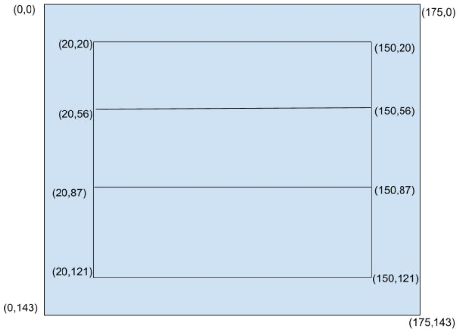

# Milestone 4

## Objective
The goal of this milestone is to have the robot detect the presence of a treasure. If a treasure is present, then the robot should recognize both the shape and color of the treasure.

## Detecting Color/Presence of a Treasure:

The first component of our treasure detection is to determine if a treasure is present and what color it is. This is done by examining the color of each pixel in an image. At the positive edge of the 25 MHz clock, we check the value of VGA_VSYNC_NEG. If VGA_VSYNC_NEG is LOW, then we reset our counters to prepare for the next image. If it is high, we check the color of the current pixel. The pixels are in RGB332 format. First, we check if PIXEL_IN[7:6](RedMSBs) are greater than PIXEL_IN[4:3](GreenMSBs) and PIXEL_IN[1:0](BlueMSBs). If so, a pixel is red. If not, we check if PIXEL_IN[1:0] < 2’b11, PIXEL_IN[7:6] < 2’b01, and PIXEL_IN[4:3] < 2’b01. This lets us better detect darker blues, which is often what we see when looking at a blue treasure.  If a pixel is determined to be red or blue, we increment the appropriate counter (red_count or blue_count). We then check these counters against a threshold to determine if a treasure is present. If there are more than 5000 red pixels on screen, we determine a red treasure to be present. If there are more than 7000 blue/dark pixels on screen, we determine a blue treasure to be present. Our condition on detecting blue pixels can lead us to seeing any dark image as a blue treasure, but in a maze of white walls we believe this will not be a major issue. If neither red_count or blue_count meets the threshold, we determine there to be no treasure present and set our RESULT value.

## Detecting Shape of a Treasure:

Now that we have found a red/blue treasure, we need to determine its shape. This is accomplished by dividing our screen up into three horizontal bars and comparing the number of pixels present in each bar. Our image is 176x144 pixels, but the treasure will ideally be in the middle of the image so we remove some of the edges to block out noisy pixels. This leaves us with three roughly equal sections to compare. When determining a pixels color, we also determine its location. We use VGA_PIXEL_X and VGA_PIXEL_Y to check if the current pixel is within one of these three bars. If this is the case, we increment the appropriate counter (red/blue_top, red/bue_mid, or red/blue_bot). After the color of the treasure is determined, we then look the shape. The first if statement searches for triangles. This is done by comparing the number of red/blue pixels in each bar. If the top bar has less pixels than the middle, which in turn has less pixels than the bottom (with a threshold added on) then it is a triangle. If the middle bar contains more red/blue pixels than the top and bottom bars (with a threshold added) then it is diamond. If it is neither of these cases, we say it is a square. The threshold is added on for consistency. Now that we have the color and shape of the treasure, we set our RESULT value.

{:height="480px" width="640px"}

## Passing Color and Shape Information to the Arduino:
The Arduino receives the RESULT value over three digital pins.  Our 3 bit RESULT value works as follows: RESULT[2] represents color ( 0 = red, 1 = blue), and RESULT[1:0] represent shape (00 = no treasure, 01 = triangle, 10 = diamond, 11 = square). At intersections, the Arduino will call a method to detect treasures. In this method, we set an averaging value to be 0 and then add onto it based on what treasure is detected. A for loop is run 30 times, each time adding onto this value. After the loop is done, we average this value to get a more accurate measure of what treasure is present. Red treasures are represented by 1,2,3, no treasure is 4, and blue treasures are 5,6,7. Having no treasure in the middle helps prevent our averaging from getting messed up (i.e. if no treasure was one and blue square is 7, the average would be a red treasure).

## Updating the GUI:
Once the shape and color of the treasure are determined, the information is ready to be sent over to the base station. A variable of type byte called treasureInfo is originally set to be all 0’s at each intersection. Using bit-masking, various bits in treasureInfo are set to 1 to convey shape and color of the treasure. The least significant bit of treasureInfo relays information about the treasure color: 1 for blue and 0 for red. The two bits to the left of this are bits relaying information about the shape of the treasure. The default value of 00 is to indicate no treasure present. If no treasure is present, then the color bit is ignored. 01 represents a triangle, 10 a square, and 11 a diamond.

The following is a video showing correct treasure color and shape detection:
<iframe width="640" height="480" src="https://www.youtube.com/embed/3EdZmnrd0xw" frameborder="0" allowfullscreen></iframe> 